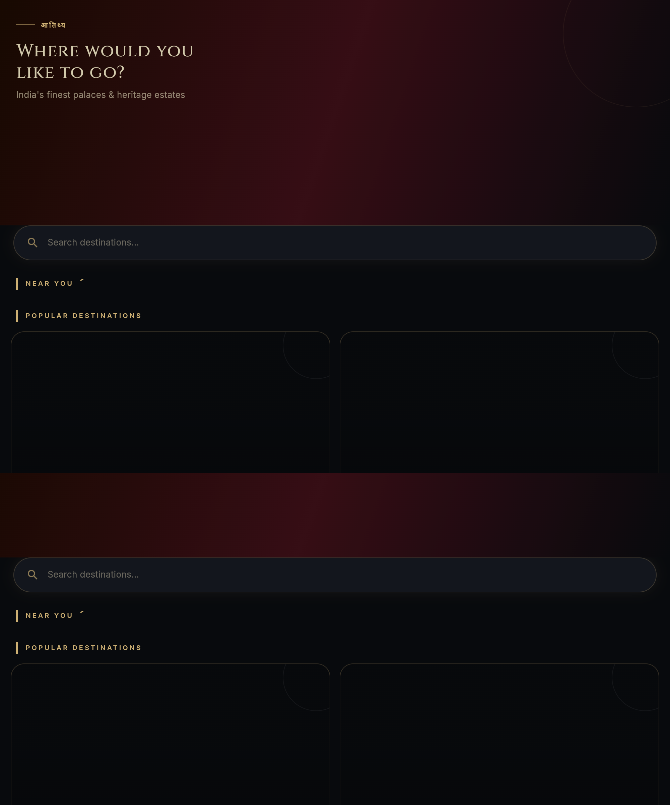
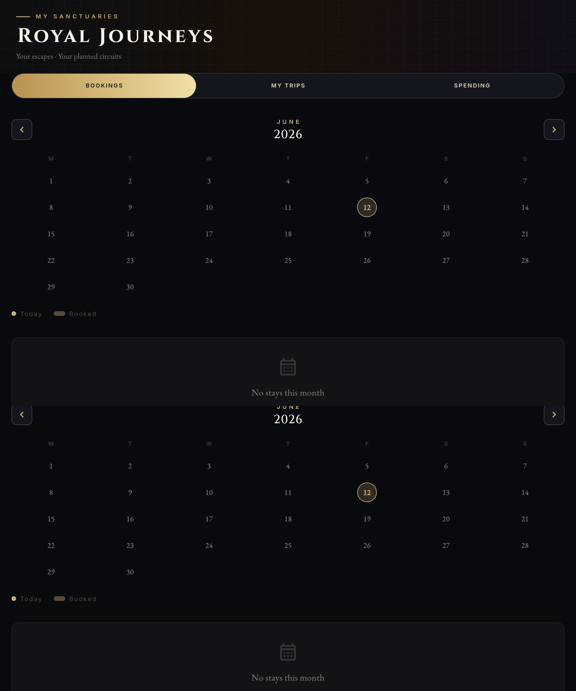
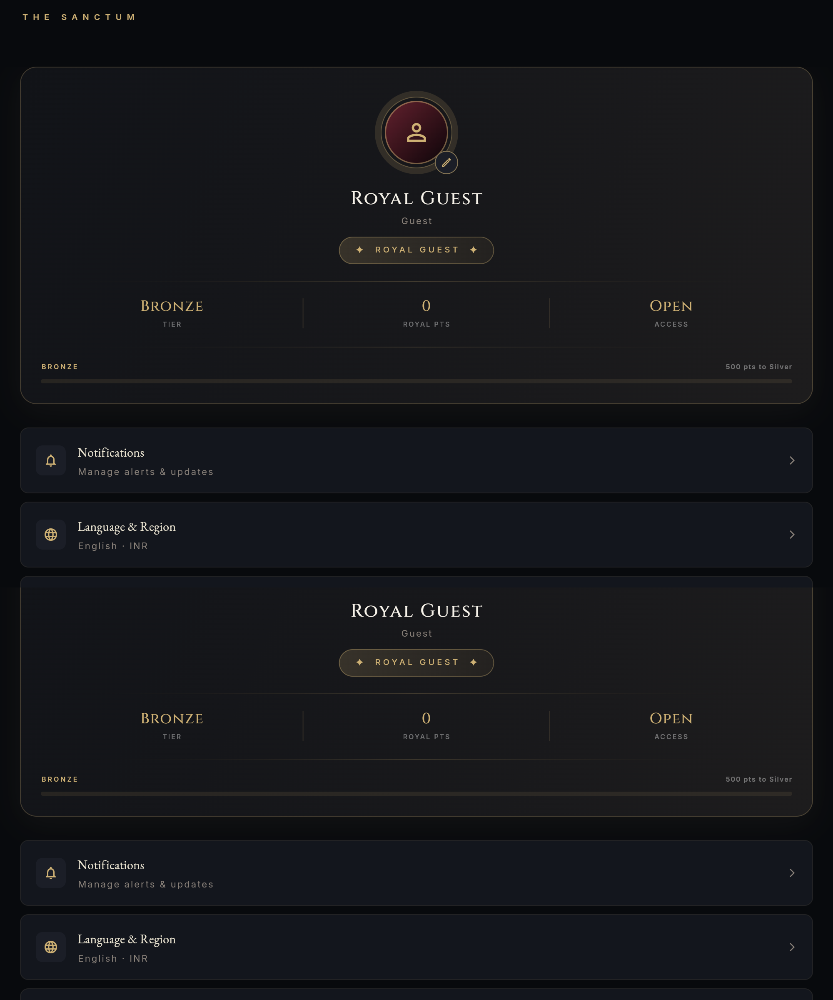

# Atithya Flutter Web Cypress E2E Testing Suite 🌸

This repository contains the Cypress E2E test suite for the [Atithya](https://jeevan-04.github.io/Atithya/) Flutter web application.

The test suite automates two primary flows:
1. **Elite Member Access:**
   - Visits the landing page and activates accessibility semantics.
   - Enters a registered phone number.
   - Triggers OTP generation, dynamically extracts the development OTP from the page, inputs the OTP, and verifies/enters the dashboard.
   - Dynamically navigates back to the main landing page (with fallback retry logic).
2. **Royal Guest Access:**
   - Enters as a Royal Guest.
   - Navigates through all core tabs: **PALACES**, **JOURNEYS**, and **SANCTUM**.
   - Triggers the **DEPART THE PALACE** action to log out.

---

## 🛠️ The Challenge: Cypress vs. Flutter Web

Testing **Flutter Web** apps with **Cypress** presents significant challenges compared to standard HTML/CSS web applications. Cypress is designed around the standard Document Object Model (DOM), whereas Flutter Web has a completely custom rendering engine.

### 1. Canvas-Based Rendering
Flutter compiles widgets directly into a **Skia/CanvasKit WebAssembly Canvas** or custom HTML elements. The standard DOM elements that Cypress expects (like buttons, lists, text inputs) do not exist as native HTML nodes. Instead, the screen is essentially a single canvas paint.

### 2. Shifting Accessibility Semantics
To allow screen readers and test engines to interact with the app, Flutter overlays a transparent **Semantic DOM Tree** (using `<flt-semantics>` and `<flt-semantics-placeholder>` tags) on top of the canvas.
* **The Problem:** The IDs of these semantic nodes (e.g., `flt-semantic-node-16`, `flt-semantic-node-51`) are generated dynamically based on build order and widget lifecycle. They **shift frequently** between application restarts and runs, which makes hardcoded selector scripts highly fragile.

### 3. Actionability & Keyboard Input
Standard Cypress commands like `.clear()` and `.type()` require standard HTML elements (e.g., `<input>`). Flutter Web projects keypresses onto hidden text fields overlaying the canvas. Trying to type directly into custom `<flt-semantics>` elements throws Cypress validation errors.

### 4. Lazy-Loaded Elements (Viewport Off-Screen)
Flutter Web optimizes performance by only rendering semantic DOM nodes for widgets currently visible on the screen. If a button (like "DEPART THE PALACE" at the bottom of the Sanctum page) is scrolled off-screen, its DOM element literally **does not exist** yet.

---

## 💡 How We Solved It

We implemented a highly resilient Cypress architecture specifically tailored for Flutter Web:

1. **Robust Dynamic ID Selection (`clickSemanticNode`)**
   We created a smart helper that attempts to find elements by ID (for speed), but crucially verifies that the text contents match. If the IDs have shifted, it immediately falls back to a text-based query (`cy.contains`), making it immune to shifting DOM IDs:
   ```javascript
   function clickSemanticNode(id, textRegex) {
     cy.wait(1000);
     cy.document().then(doc => {
       const node = doc.getElementById(id);
       if (node && textRegex.test(node.innerText || node.textContent || '')) {
         cy.wrap(node).click({ force: true });
       } else {
         cy.contains(textRegex, { timeout: 10000 }).should('be.visible').click({ force: true });
       }
     });
   }
   ```

2. **Heuristics for Custom Element Typing**
   Instead of calling `.clear().type()` on custom `<flt-semantics>` elements (which throws errors), we click the semantic node to trigger Flutter's focus handling, and then type directly into the browser's active focused element (which is the hidden input field created by Flutter):
   ```javascript
   cy.wrap(otpNode).click({ force: true }).then(() => {
     cy.focused().type(code, { force: true });
   });
   ```

3. **Viewport Resizing for Lazy-Loaded Nodes**
   We added `cy.viewport(1000, 1200)` at the beginning of the test. Increasing the viewport height forces Flutter to render the entire page layout at once, keeping elements like the logout button active in the DOM without requiring flaky scroll gestures.

4. **WASM & API Latency Tolerant Timeouts**
   * Increased the initial accessibility element timeout to `60000ms` to account for CanvasKit compilation speeds.
   * Increased the OTP extraction timeout to `60000ms` to gracefully handle Render.com free-tier backend cold starts.

---

## 📸 Step-by-Step Execution Journey

Below is the step-by-step trace captured during a successful test run:

### 1. Landing Page (Semantics Enabled)
The landing page with "Enter as Elite Member" and "Continue as Royal Guest" buttons.


### 2. Enter as Elite Member Clicked
Navigation to the mobile verification page.


### 3. Mobile Entered & OTP Sent
The mobile number `1234567890` is entered and the OTP request is sent to the backend.


### 4. OTP Retrieved & Entered
The development OTP is parsed and typed into the verification inputs.


### 5. Back to Landing Page
The verification proceeds, and the suite triggers back-navigation to return to the landing page.


### 6. Continue as Royal Guest Clicked
Clicking the "Continue as Royal Guest" button to enter the main dashboard.


### 7. Palaces Tab
Exploring the **PALACES** tab.


### 8. Journeys Tab
Exploring the **JOURNEYS** tab.


### 9. Sanctum Tab
Exploring the **SANCTUM** tab profile.


### 10. Depart the Palace (Logged Out)
The "DEPART THE PALACE" button is clicked, returning the user to the landing page.


---

## 🎥 Full Run Video Demonstration

Watch the complete, end-to-end automated headed browser run recorded by Cypress:

* **Direct Video File:** [cypress/videos/spec.cy.js.mp4](cypress/videos/spec.cy.js.mp4)

<video src="cypress/videos/spec.cy.js.mp4" controls width="100%"></video>

---

## 🚀 Running Locally

### Prerequisites
* [Node.js](https://nodejs.org/) (v18+)

### Installation
Clone this repository and install the dependencies:
```bash
npm install
```

### Execution

* **Interactive Mode (Cypress Launchpad):**
  ```bash
  npx cypress open
  ```
* **Headed CLI Run (Chrome):**
  ```bash
  npx cypress run --headed --browser chrome
  ```
